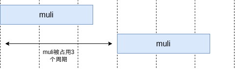

# Lab: 高层次综合调度实现
在这个Lab里，实现一个高层次综合的调度算法，处理没有控制流情况下的调度问题。你需要根据输入的数据流图（DFG）和资源约束，确定每个操作的开始执行周期，使得总延迟最小化，同时满足时钟周期和资源限制。

有问题可以先到 [Issues](https://github.com/pku-liang/hlcd-hls-lab-handout/issues?q=label:question) 里去找找看。

**截止日期: 2025年1月5日（延长至1月10日）**

## 输入格式

### DFG文件

第一行三个自然数n m k,分别表示memory个数、输入参数个数、和ir行数。

接下来k行,每行以字符串开头表示op_type,接下来包括若干自然数,表示该op的所有operand,其中-1代表常数。对于load和store，其第一个operand的值为memory。

其中第i行如果有返回值,则结果为(n+m+k)。

### Resource文件

第一行输入一个正整数t和一个浮点数clock_period,表示一共有t种type类型,时钟周期限制为clock_period。

接下来t行,每行以字符串开头表示op_type,接下来4个数分别表示operand_num,delay,latency,limit。

operand_num表示该op的operand数量。例如%3 = addi %1 %2,则operand_num=2。

delay表示该运算的组合延迟,最终需要满足同一周期内的运算依赖保证关键路径长度不超过clock_period,latency为该运算所需周期数。
时序运算开始的那个周期不能有其他依赖的运算，但是在其计算的最后一个cycle可以计算依赖它结果的组合运算。例如下图所示，当有 `muli(latency=2, delay=4.0)` 和 `addi(latency=0, delay=3.0)` 且 `clock=10.0` 时，第 $i$ 周期计算 `muli`，对于依赖其结果的 `addi`，可以在第 $i+1$ 周期开始计算（此时第 $i+1$ 周期中 `addi` 的关键路径长度为7.0），而依赖其结果的 `muli` 则必须在第 $i+2$ 周期（含）之后开始计算。


limit为该运算单元的数量，任意周期内正在执行的运算不能超过该数量（latency=k的运算需要占用这个资源k个周期，如果limit=1的话，下一个运算需要在k周期之后开始），-1表示该运算没有限制（对于latency=0的组合逻辑，保证limit=-1）。

如下图所示，latency=3的muli运算会在执行的3个周期中占用muli资源，另一个共用资源的muli需要在3个周期之后开始执行



load和store运算的limit为memory的端口数量，相同且只为1或2。所有对同一个memory的load和store运算共享这limit个端口资源。

## 样例输入

```
//DFG input
3 2 3
shift_left 4 -1
addi 4 6
store 2 5 7

//Resource input
3 5.0
shift_left 2 0.1 0 -1
addi 2 3.1 0 -1
store 3 2.1 1 2
```

## 样例输入解释

三个memory:%1, %2, %3

两个输入参数:%4, %5

op1: %6 = shift_left %4 -1

op2: %7 = addi %4 %6

op3: store %2[%5] = %7

```
int v1[], v2[], v3[];
void func(int v4, int v5) {
  int v6 = v4 << 3;
  int v7 = v4 + v6;
  v2[v5] = v7;
}
```

## 输出格式

接下来一共k行,每行一个正整数,表示第几周期运行。

## 样例输出

```
1
1
2
```

## 样例输出解释

shift_left和addi在第一个周期运行,store在第二个周期运行。

最长clock period为shift_left+addi: $0.1+3.1=3.2\leq5.0$

## 代码框架

输入输出的相关处理代码已经提供，你只需要实现 `scheduler.cpp` 中的 `schedule` 函数。
其参数 `DFG *dfg` 为需要被调度的数据图形式，其中每个 `Stmt*` 表示一个运算，可以通过虚函数
`is_mem_stmt` 判断该运算是否为 `load/store` op，并通过 `get_arr_idx` 获取访问的memory标号。
`vector<Op*> &ops` 保存了所有运算资源的信息，
`double clock_period` 为目标时钟周期。你可以通过 `get_deps_and_uses` 获取运算之间的依赖关系。

你实现的 `schedule` 函数需要为每个 `Stmt` 求出 `start_cycle`，表示这个op开始计算的时钟周期，`start_cycle` 需要是正整数。

最后latency的计算规则为:

$$\text{max}_i \left\lbrace\ \text{start-cycle}_i + \text{max}(\text{latency}_i-1, 0) \right\rbrace$$

### 运行方法
- 运行 `make sched` 编译调度程序
- 运行 `make verifier` 编译检查程序
- 运行 `make test TEST=[1..5]` 运行对应测试点，生成的schedule.txt文件会保存你的调度结果。

### 调度结果检查
verifier将依次检查调度结果的三个部分： `Dependence`，`Clock period` 和 `Resource Utilization`。
- 当 `Dependence` 约束没有被满足时，会报告存在依赖关系的两个运算，以及他们被调度的周期
- 当 `Clock period` 约束没有被满足时，会报告超过 clock period 的关键路径上的运算
- 当 `Resource utilization` 约束没有被满足时，会报告在哪个周期的资源约束超出限制，以及使用这个资源的运算

当所有检查通过时，verifier会报告最终的latency和对应的分数。你将会看到：
```
================
||    PASS    ||
================
Total latency: 97
Score: 89.32
```

## 评分标准

最终测试实例包括下发的5个open test和若干hidden test，两个部分各占50%，测试点的运行时间为 `1 min`。
每个测试点的评分规则如下：

- 当你的调度结果错误或者运行超时，你在该问题上的得分为0。
- 当你的调度结果正确时，你在该问题上的得分为 $\text{min}(100, \text{max}(60, (\text{latency}-\text{asap})*\text{ratio}+80))$，其中 $\text{ratio}=\frac{(100 - 80)}{\text{satsdc}-\text{asap}}$。 即固定参考实现的ASAP算法结果为80分，SAT+SDC算法结果为100分，其他结果按照两者连成的线性函数计算，不低于60分。

## Minisat求解器使用

实现SDC+SAT需要调用SAT求解器，下发代码中提供了minisat作为可能用到的SAT求解器。若 `minisat/` 目录为空，则运行 `git submodule init -- minisat`。
先运行 `make test_minisat` 测试minisat是否能正常运行，如果该命令失败，则进入 `minisat/`，运行 
```bash
mkdir build && cd build && cmake .. -DCMAKE_CXX_FLAGS=-fpermissive && make
```
并将 `minisat/build/libminisat.a` 复制到本项目根目录下。

Minisat的接口具体使用方法如下：

```c++
#include <minisat/core/Solver.h>

int main() {
  // Minisat中的函数都在namespace Minisat中
  // 如果不想每次都加Minisat::，可以using namespace Minisat;
  Minisat::Solver solver;
  
  Minisat::Var a, b, c;
  // 声明新变量
  a = solver.newVar();
  b = solver.newVar();
  c = solver.newVar();

  // 添加clause: a OR !b
  solver.addClause(Minisat::mkLit(a), Minisat::mkLit(b, true /*表示!b*/));

  // 添加可变长度的clause
  Minisat::vec<Minisat::Lit> clause;
  clause.push(Minisat::mkLit(a, true));
  clause.push(Minisat::mkLit(b, true));
  clause.push(Minisat::mkLit(c));
  solver.addClause(clause);

  bool result = solver.solve();
  if (result == true) {
    // true表示有解， false表示没有
    // 通过常量表示true，false
    printf("%d %d\n", Minisat::l_True, Minisat::l_False);

    // 查询solution中Literal对应的值
    printf("%d\n", solver.modelValue(Minisat::mkLit(a)));
    printf("%d\n", solver.modelValue(Minisat::mkLit(b)));
    // 这里查询的是!c对应的值
    printf("%d\n", solver.modelValue(Minisat::mkLit(c, true)));
  }
}
```

## Hint

### 关于SDC
参考论文 [An efficient and versatile scheduling algorithm based on SDC formulation](https://dl.acm.org/doi/10.1145/1146909.1147025)。

SDC的linear order选取对调度有较大的影响，直接拿拓扑序当linear order简单但是效果不一定好（可能比ASAP还差）。可以考虑从其他调度方法的结果中得到linear order并根据资源的实际使用情况对order进行调整。

### 关于SAT+SDC
参考论文 [A Scalable Approach to Exact Resource-Constrained Scheduling Based on a Joint SDC and SAT Formulation](https://dl.acm.org/doi/10.1145/3174243.3174268)。

SAT+SDC的求解效率会更慢，注意时间限制。SAT编码的时候除了关于resource的约束之外，可以考虑加入一些clause，将对于调度问题不合理的解去掉（例如但不限于 $O_{i \rightarrow j}$ 和 $O_{j \rightarrow i}$ 同时为真），这样相比通过SDC找负环得到这些冲突子句要高效的多。

## 作业提交

请将整个文件夹提交到 `/root/handin/hw4` 目录。
